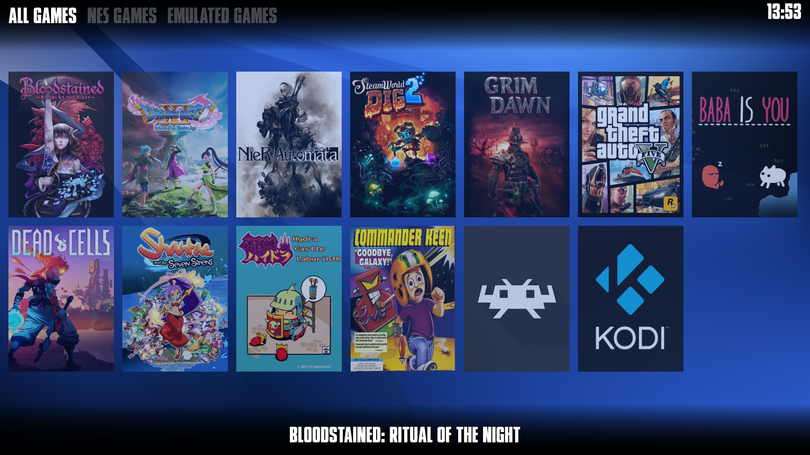

# pylauncher
Python game launcher with gamepad support.

## Running: ##

- Install `pygame` with `pip`

- Run `main.py` using `python` in your OS

## How it works: ##

- First it loads `autostart.sh` script on startup

- Looks for files with extension `.list`

- First line in `.list` file is the game list name and then there's an empty new line for separation

- Next lines are as follows for all games in list: 
  - Name of the game
  - Command to run to start the game
  - The directory to run the game in
  - Box art location
  - Empty line as separator

## Controls: ##

- Keyboard:
  - Arrows to choose
  - Enter to start game
  - Tab and Shift-Tab to move between game lists
  - ESC to quit

- Gamepad:
  - D-pad to choose
  - First button to start game (for example button A)
  - Shoulder buttons L1 and R1 to switch between game lits
  - Both stick buttons at the same time to quit

## Screenshot: ##

